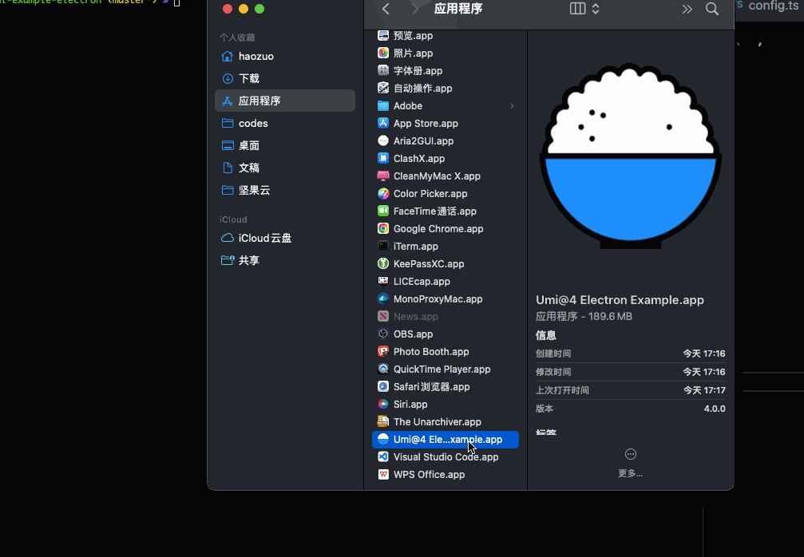

# Umi@4 Excample Electron

 ![][david-url]

Electron example with [umijs@4](https://umijs.org/)



## Reference

[Hosts-High](https://github.com/leftstick/hosts-high)

## How To Use?

> clone repo first

```bash
pnpm i
pnpm dev
```

> once code changed, you may need `ctrl/cmd + shift + r` to reload it.

## LICENSE

[mit license]: https://raw.githubusercontent.com/umijs/umi-example-electron/master/LICENSE
[david-url]: https://david-dm.org/umijs/umi-example-electron.png
